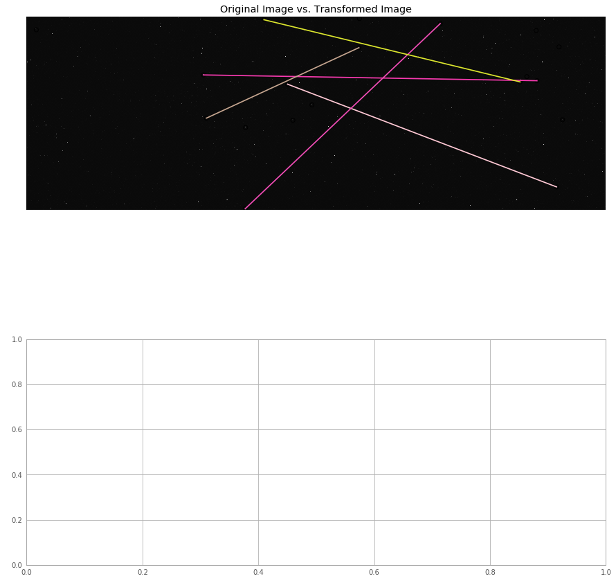

## Differential Time Lapse tool Scratchpad

1. getting familiar with the FITS file format and handling it in Python using astropy pyfits
2. analyzing ways to align images:
      1. Feature extraction and alignment
      2. Using 3-point asterisms. Source: https://github.com/toros-astro/astroalign
      3. Using WCS data in headers.
3. compiling aligned images into a video stream      


```python
import matplotlib.pyplot as plt
from astropy.io import fits
from astropy.visualization import astropy_mpl_style
plt.style.use(astropy_mpl_style)
```


```python
%matplotlib auto
import time
```

    Using matplotlib backend: TkAgg
    


```python
path = r'20190405T110036.fits.fz'
path1 = r'20190405T110332.fits.fz'

```


If the .data attribute on the primary HDU is None that means the primary HDU contains no data. You can confirm this by checking the file info:<br>

hdulist.info() <br>
Chances are you're trying to read a multi-extension FITS file, and the data you're looking for is in another castle, I mean, HDU.  disable_image_compression=True wouldn't help since that disables support for compressed images :)<br>

ETA: In fact, a tile-compressed FITS image can never be in the primary HDU, since it's stored internally as a binary table, which can only be an extension HDU.<br>

Source: [stackoverflow ](https://stackoverflow.com/questions/20844385/pyfits-read-compressed-fits-file)


```python
hdul = fits.open(path)
hdul.info()
hdu1 = hdul[1]
print("BZERO:{0} and BSCALE: {1} with BITPIX: {2}".format(hdu1.header['bzero'],hdu1.header['bscale'],hdu1.header['bitpix']))

data_grab = hdul[0].data
print(type(data_grab),data_grab)
image_data1 = hdul[1].data
print(type(image_data1))
print('Note: Headers BZERO,BSCALE are lost after scaling')
print(hdul[1].header)
hdul.close()
```

    Filename: 20190405T110036.fits.fz
    No.    Name      Ver    Type      Cards   Dimensions   Format
      0  PRIMARY       1 PrimaryHDU       8   ()      
      1  COMPRESSED_IMAGE    1 CompImageHDU    180   (5208, 3476)   int16   
    BZERO:32768 and BSCALE: 1 with BITPIX: 16
    <class 'NoneType'> None
    <class 'numpy.ndarray'>
    Note: Headers BZERO,BSCALE are lost after scaling
    SIMPLE  =                    T / conforms to FITS standard                      BITPIX  =                   16 / array data type                                NAXIS   =                    2 / number of array dimensions                     NAXIS1  =                 5208 / width of table in bytes                        NAXIS2  =                 3476 / number of rows in table                        PCOUNT  =                    0 / size of special data area                      GCOUNT  =                    1 / one data group (required keyword)              XTENSION= 'BINTABLE'           / binary table extension                         FILTER  = 'RGGB    '                                                            ISO     =                  100                                                  EXPTIME =                  120                                                  CAMTEMP = '17 C    '           / Celsius - From CR2                             CIRCCONF= '0.019 mm'           / From CR2                                       COLORTMP=                 5009 / From CR2                                       FILENAME= '20190405T110036.cr2' / From CR2                                      INTSN   = 'HA0028608'          / From CR2                                       CAMSN   = '012070048413'       / From CR2                                       MEASEV  =                -3.75 / From CR2                                       MEASEV2 =                -3.75 / From CR2                                       MEASRGGB= '625 1024 1024 682'  / From CR2                                       WHTLVLN =                11765 / From CR2                                       WHTLVLS =                12277 / From CR2                                       REDBAL  =             1.935547 / From CR2                                       BLUEBAL =             1.563477 / From CR2                                       WBRGGB  = '' / From CR2                                                         DATE-OBS= '2019-04-05T10:54:44'                                                 IMAGEID = 'PAN001_14d3bd_20190405T110036'                                       SEQID   = 'PAN001_14d3bd_20190405T105859'                                       FIELD   = 'TESS_SEC11_CAM01'                                                    RA-MNT  =             217.3031 / Degrees                                        HA-MNT  =    23.04837039793174 / Degrees                                        DEC-MNT =             -33.7306 / Degrees                                        COMMENT Original key: "EQUINOX"                                                 _QUINOX =               2000.0                                                  AIRMASS =     1.74918459668997 / Sec(z)                                         LAT-OBS =                19.54 / Degrees                                        LONG-OBS=              -155.58 / Degrees                                        ELEV-OBS=               3400.0 / Meters                                         MOONSEP =    35.59945044621102 / Degrees                                        MOONFRAC= 0.001969766549680119                                                  CREATOR = 'POCSv0.6.2'         / POCS Software version                          INSTRUME= '14d3bd  '           / Camera ID                                      OBSERVER= 'PAN001  '           / PANOPTES Unit ID                               ORIGIN  = 'Project PANOPTES'                                                    RA-RATE =                  1.0 / RA Tracking Rate                               COMMENT Original key: "END"                                                     COMMENT                                                                         COMMENT --Start of Astrometry.net WCS solution--                                COMMENT --Put in by the new-wcs program--                                       COMMENT                                                                         WCSAXES =                    2 / no comment                                     CTYPE1  = 'RA---TAN-SIP' / TAN (gnomic) projection + SIP distortions            CTYPE2  = 'DEC--TAN-SIP' / TAN (gnomic) projection + SIP distortions            EQUINOX =               2000.0 / Equatorial coordinates definition (yr)         LONPOLE =                180.0 / no comment                                     LATPOLE =                  0.0 / no comment                                     CRVAL1  =        217.188642184 / RA  of reference point                         CRVAL2  =       -33.6425673333 / DEC of reference point                         CRPIX1  =               2604.5 / X reference pixel                              CRPIX2  =               1738.5 / Y reference pixel                              CUNIT1  = 'deg     ' / X pixel scale units                                      CUNIT2  = 'deg     ' / Y pixel scale units                                      CD1_1   =   -9.20976618818E-06 / Transformation matrix                          CD1_2   =    -0.00286084536381 / no comment                                     CD2_1   =    -0.00286227842257 / no comment                                     CD2_2   =    1.05400925039E-05 / no comment                                     IMAGEW  =                 5208 / Image width,  in pixels.                       IMAGEH  =                 3476 / Image height, in pixels.                       A_ORDER =                    2 / Polynomial order, axis 1                       A_0_0   =                    0 / no comment                                     A_0_1   =                    0 / no comment                                     A_0_2   =   -6.36579337084E-07 / no comment                                     A_1_0   =                    0 / no comment                                     A_1_1   =    2.03333417975E-08 / no comment                                     A_2_0   =   -4.12187469383E-08 / no comment                                     B_ORDER =                    2 / Polynomial order, axis 2                       B_0_0   =                    0 / no comment                                     B_0_1   =                    0 / no comment                                     B_0_2   =   -1.74760171758E-07 / no comment                                     B_1_0   =                    0 / no comment                                     B_1_1   =   -5.04361170893E-07 / no comment                                     B_2_0   =    4.16691249053E-08 / no comment                                     AP_ORDER=                    2 / Inv polynomial order, axis 1                   AP_0_0  =    3.88331529599E-06 / no comment                                     AP_0_1  =    2.46343451765E-07 / no comment                                     AP_0_2  =    6.36576961288E-07 / no comment                                     AP_1_0  =     7.6267473019E-07 / no comment                                     AP_1_1  =   -2.03340036943E-08 / no comment                                     AP_2_0  =    4.12181942291E-08 / no comment                                     BP_ORDER=                    2 / Inv polynomial order, axis 2                   BP_0_0  =    1.62092798468E-06 / no comment                                     BP_0_1  =     1.3730202132E-06 / no comment                                     BP_0_2  =    1.74759143841E-07 / no comment                                     BP_1_0  =    1.10284500462E-07 / no comment                                     BP_1_1  =    5.04360633646E-07 / no comment                                     BP_2_0  =   -4.16694023687E-08 / no comment                                     HISTORY Created by the Astrometry.net suite.                                    HISTORY For more details, see http://astrometry.net.                            HISTORY Git URL https://github.com/dstndstn/astrometry.net                      HISTORY Git revision 0.73                                                       HISTORY Git date Thu_Nov_16_08:30:44_2017_-0500                                 HISTORY This WCS header was created by the program "blind".                     DATE    = '2019-04-05T01:03:09' / Date this file was created.                   COMMENT -- blind solver parameters: --                                          COMMENT Index(0): /var/panoptes/astrometry/data/index-4218.fits                 COMMENT Index(1): /var/panoptes/astrometry/data/index-4217.fits                 COMMENT Index(2): /var/panoptes/astrometry/data/index-4216.fits                 COMMENT Index(3): /var/panoptes/astrometry/data/index-4215.fits                 COMMENT Index(4): /var/panoptes/astrometry/data/index-4214.fits                 COMMENT Index(5): /var/panoptes/astrometry/data/index-4213.fits                 COMMENT Index(6): /var/panoptes/astrometry/data/index-4212.fits                 COMMENT Index(7): /var/panoptes/astrometry/data/index-4211.fits                 COMMENT Index(8): /var/panoptes/astrometry/data/index-4210.fits                 COMMENT Index(9): /var/panoptes/astrometry/data/index-4118.fits                 COMMENT Index(10): /var/panoptes/astrometry/data/index-4117.fits                COMMENT Index(11): /var/panoptes/astrometry/data/index-4116.fits                COMMENT Index(12): /var/panoptes/astrometry/data/index-4115.fits                COMMENT Index(13): /var/panoptes/astrometry/data/index-4114.fits                COMMENT Index(14): /var/panoptes/astrometry/data/index-4113.fits                COMMENT Index(15): /var/panoptes/astrometry/data/index-4112.fits                COMMENT Index(16): /var/panoptes/astrometry/data/index-4111.fits                COMMENT Index(17): /var/panoptes/astrometry/data/index-4110.fits                COMMENT Field name:                                                             COMMENT   /var/panoptes/images/fields/Tess_Sec11_Cam01/14d3bd/201904            COMMENT   05T105859/20190405T110036.axy                                         COMMENT Field scale lower: 0.0691244 arcsec/pixel                               COMMENT Field scale upper: 124.424 arcsec/pixel                                 COMMENT X col name: X                                                           COMMENT Y col name: Y                                                           COMMENT Start obj: 0                                                            COMMENT End obj: 10                                                             COMMENT Solved_in: (null)                                                       COMMENT Solved_out:                                                             COMMENT   /var/panoptes/images/fields/Tess_Sec11_Cam01/14d3bd/201904            COMMENT   05T105859/20190405T110036.solved                                      COMMENT Solvedserver: (null)                                                    COMMENT Parity: 2                                                               COMMENT Codetol: 0.01                                                           COMMENT Verify pixels: 1 pix                                                    COMMENT Maxquads: 0                                                             COMMENT Maxmatches: 0                                                           COMMENT Cpu limit: 15.000000 s                                                  COMMENT Time limit: 0 s                                                         COMMENT Total time limit: 0 s                                                   COMMENT Total CPU limit: 15.000000 s                                            COMMENT Tweak: yes                                                              COMMENT Tweak AB order: 2                                                       COMMENT Tweak ABP order: 2                                                      COMMENT --                                                                      COMMENT -- properties of the matching quad: --                                  COMMENT index id: 4117                                                          COMMENT index healpix: -1                                                       COMMENT index hpnside: 0                                                        COMMENT log odds: 115.9                                                         COMMENT odds: 2.16191e+50                                                       COMMENT quadno: 3659                                                            COMMENT stars: 286,7,10,0                                                       COMMENT field: 8,5,3,0                                                          COMMENT code error: 0.00104993                                                  COMMENT nmatch: 10                                                              COMMENT nconflict: 0                                                            COMMENT nfield: 2815                                                            COMMENT nindex: 10                                                              COMMENT scale: 10.3017 arcsec/pix                                               COMMENT parity: 0                                                               COMMENT quads tried: 48                                                         COMMENT quads matched: 183                                                      COMMENT quads verified: 1                                                       COMMENT objs tried: 9                                                           COMMENT cpu time: 0.004                                                         COMMENT --                                                                      COMMENT                                                                         COMMENT --End of Astrometry.net WCS--                                           COMMENT --(Put in by the new-wcs program)--                                     COMMENT                                                                         CHECKSUM= 'XSAdYS8ZXSAdXS5Z'   / HDU checksum updated 2019-04-05T15:48:55       DATASUM = '3085208444'         / data unit checksum updated 2019-04-05T15:48:55 EXTEND  =                    T                                                                                                                                                                                                                  END                                                                                                                                                                                                                                                                                                                                                                                                                                                                                                                                                                                                                                                                                                                                                                                                                                                                                                                                                                                                                                                                                                                                                                                                                                                                                                                                                                                                                                                                                                                                                                                                                                                                                                                                                                                                                                                                                                                                                                                                                                                                                                                                                                                                                                                                                                                                                                                                                                                                                                                                                                                                                                                                                                                                                                                                                                                                                                                                                                                             
    


```python
hdul = fits.open(path1)
hdul.info()
hdu1 = hdul[1]
print("BZERO:{0} and BSCALE: {1} with BITPIX: {2}".format(hdu1.header['bzero'],hdu1.header['bscale'],hdu1.header['bitpix']))

data_grab = hdul[0].data
print(type(data_grab),data_grab)
image_data2 = hdul[1].data
print(type(image_data1))
print('Note: Headers BZERO,BSCALE are lost after scaling')
print(hdul[1].header['CTYPE1'])
print(hdul[1].header['CTYPE2'])
hdul.close()
```

    Filename: 20190405T110332.fits.fz
    No.    Name      Ver    Type      Cards   Dimensions   Format
      0  PRIMARY       1 PrimaryHDU       8   ()      
      1  COMPRESSED_IMAGE    1 CompImageHDU    180   (5208, 3476)   int16   
    BZERO:32768 and BSCALE: 1 with BITPIX: 16
    <class 'NoneType'> None
    <class 'numpy.ndarray'>
    Note: Headers BZERO,BSCALE are lost after scaling
    RA---TAN-SIP
    DEC--TAN-SIP
    

As expected, the PrimaryHDU is empty. The image is in the extensions i.e here in the second HDU.

This is a numpy ndarray which can be plotted with matplotlib


```python
plt.rcParams['figure.figsize'] = [15,15]
plt.imshow(image_data1)
```


    <matplotlib.image.AxesImage at 0x2a2902237b8>


Sometimes an image is scaled, i.e. the data stored in the file is not the image’s physical (true) values, but linearly transformed according to the equation:

physical value = BSCALE * (storage value) + BZERO <br>

BSCALE and BZERO are stored as keywords of the same names in the header of the same HDU. The most common use of scaled image is to store unsigned 16-bit integer data because FITS standard does not allow it. In this case, the stored data is signed 16-bit integer (BITPIX=16) with BZERO=32768 (215), BSCALE=1.

In astropy.io.fits, fits.open scales by default unless you specify "do_not_scale_image_data = True"

Once the data is accessed with scaling ON, the headers BZERO and BSCALE are removed

### Attempt to align images using scikit image feature extractor { infeasible }


```python
from skimage.feature import (match_descriptors, corner_harris,corner_peaks, ORB, plot_matches)
from skimage import transform as tf
```


```python
descriptor_extractor = ORB(n_keypoints=10) 

```


```python
time_start_x = time.time()
descriptor_extractor.detect_and_extract(image_data1)
descriptors_1 = descriptor_extractor.descriptors
keypoints_1 = descriptor_extractor.keypoints

descriptor_extractor.detect_and_extract(image_data2)
descriptors_2 = descriptor_extractor.descriptors
keypoints_2 = descriptor_extractor.keypoints
time_end_x = time.time()

print("Time taken is {0}".format(time_end_x-time_start_x))
```

    Time taken is 142.0890257358551
    


```python
matches12 = match_descriptors(descriptors_1, descriptors_2, cross_check=True)
```


```python
fig, ax = plt.subplots(nrows=2, ncols=1)
plt.gray()
plt.rcParams['figure.figsize'] = [30,30]
plot_matches(ax[0], image_data1, image_data2, keypoints_1, keypoints_2, matches12)
ax[0].axis('off')
ax[0].set_title("Original Image vs. Transformed Image")

plt.show()
```





It seems running ORB detection on stellar images is a bad idea. Because of the absence of kunique features the algorithm takes too long to run on a pair of images in itself and makes a lot of errors. This idea is deemed infeasible at the moment.The next idea is to use a package called astroalign which using 3-point asterism matching.

TIme taken: <b>142.1 seconds</b> for only 10 keypoints

### Using Astroalign package.


```python
import astroalign
```


```python
time_start_astroalign = time.time()
img_aligned = astroalign.register(image_data1,image_data2)
time_end_astroalign = time.time()
print("Time taken using astroalign is {0}".format(time_end_astroalign - time_start_astroalign))
```

    Time taken using astroalign is 108.09295058250427
    


```python
p, (pos_img, pos_img_rot) = astroalign.find_transform(image_data1, image_data2)
```


```python
fig, axes = plt.subplots(2, 2, figsize=(20, 20))

colors = ['r', 'g', 'b', 'y', 'cyan', 'w', 'm']

axes[0, 0].imshow(image_data1, cmap='gray', interpolation='none', origin='lower')
axes[0, 0].axis('off')
axes[0, 0].set_title("Source Image")
for (xp, yp), c in zip(pos_img[:len(colors)], colors):
    circ = plt.Circle((xp, yp), 4, fill=False, edgecolor=c, linewidth=2)
    axes[0, 0].add_patch(circ)

axes[0, 1].imshow(image_data2, cmap='gray', interpolation='none', origin='lower')
axes[0, 1].axis('off')
axes[0, 1].set_title("Target Image")
for (xp, yp), c in zip(pos_img_rot[:len(colors)], colors):
    circ = plt.Circle((xp, yp), 4 * p.scale, fill=False, edgecolor=c, linewidth=2)
    axes[0, 1].add_patch(circ)

axes[1, 1].imshow(img_aligned, cmap='gray', interpolation='none', origin='lower')
axes[1, 1].axis('off')
axes[1, 1].set_title("Source Image aligned with Target")
for (xp, yp), c in zip(pos_img_rot[:len(colors)], colors):
    circ = plt.Circle((xp, yp), 4 * p.scale, fill=False, edgecolor=c, linewidth=2)
    axes[1, 1].add_patch(circ)

axes[1, 0].axis('off')

plt.tight_layout()
plt.show()
```


The aligning seems to have worked but the time taken to align two sequential images is high.
Time taken is <b>108.1 seconds </b><br>
So moving on to alignment using Header information.


```python
from astropy.wcs import WCS
plt.rcParams['figure.figsize'] = [10,10]
hdul = fits.open(path)
image_hdu = hdul[1]
wcs = WCS(image_hdu.header)
fig = plt.figure()
fig.add_subplot(211, projection=wcs)
plt.xlabel('RA')
plt.ylabel('Dec')
plt.imshow(image_hdu.data,cmap='gray')
hdul.close()

hdul1 = fits.open(path1)
image_hdu1 = hdul1[1]
wcs1 = WCS(image_hdu1.header)
fig.add_subplot(212, projection=wcs1)
plt.xlabel('RA')
plt.ylabel('Dec')
plt.imshow(image_hdu1.data,cmap='gray')
hdul.close()
```


```python
wcs.printwcs()
wcs1.printwcs()

```

    WCS Keywords
    
    Number of WCS axes: 2
    CTYPE : 'RA---TAN-SIP'  'DEC--TAN-SIP'  
    CRVAL : 217.188642184  -33.6425673333  
    CRPIX : 2604.5  1738.5  
    CD1_1 CD1_2  : -9.20976618818e-06  -0.00286084536381  
    CD2_1 CD2_2  : -0.00286227842257  1.05400925039e-05  
    NAXIS : 5208  3476
    WCS Keywords
    
    Number of WCS axes: 2
    CTYPE : 'RA---TAN-SIP'  'DEC--TAN-SIP'  
    CRVAL : 217.199353665  -33.6427982859  
    CRPIX : 2604.5  1738.5  
    CD1_1 CD1_2  : -9.23409217247e-06  -0.00286066404264  
    CD2_1 CD2_2  : -0.00286209749112  1.0526596121e-05  
    NAXIS : 5208  3476
    


    astropy.wcs.wcs.WCS


